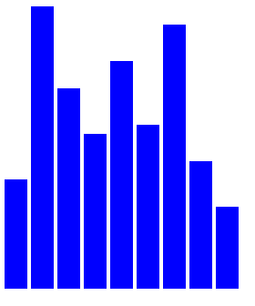

# D3

* [Add Document Elements with `.select()`, `.append()` and `.text()`](#Add-Document-Elements)
* [Select a group of elements with `.selectAll()`](#Select-a-group-of-elements)
* [Work with Data](#Work-with-Data)
* [Dynamic Data](#Dynamic-Data)
* [Inline Styling for Elements](#Inline-Styling-for-Elements)
* [Update the Height of an Element Dynamically]($Update-the-Height-of-an-Element-Dynamically)
* [Presentation of a Bar Chart](#Presentation-of-a-Bar-Chart)
* [Scalable Vector Graphics (SVG)](#Scalable-Vector-Graphics-(SVG))
* [Displaying `svg` shapes](#Displaying-svg-shapes)
* [Bar Charts: `rect` vs `div`](#Bar-Charts:-rect-vs-div)
* [Setting the coordinates for each bar](#Setting-the-coordinates-for-each-bar)
***

## Add Document Elements

The `select()` method selects one element from the document. It takes an argument for the name of the element you want and returns an HTML node for the first element in the document that matches the name. 

The `append()` method takes an argument for the element you want to add to the document. It appends an HTML node to a selected item, and returns a handle to that node.

The `text()` method either sets the text of the selected node, or gets the current text. To set the value, you pass a string as an argument inside the parentheses of the method.

The following will render an `h1` tag with "hello world".

```html
<body>
  <script>
    d3.select("body")
      .append("h1")
      .text("Learning D3")
  </script>
</body>
```
***
## Select a group of elements

`selectAll()` returns an array of HTML nodes for all the items in the document that match the input string. 

The following will select all `li` items and change the text to "list items".

```javascript
    d3.selectAll("li")
      .text("list item")
```
***
## Work with Data

The `data()` method makes D3 aware of a data set, accepting the data itself as an argument.  The `enter()` method helps create a new element in the document for each piece of data within the set.  If there are fewer elements than pieces of data already on the dom, `enter()` will creat more.

The following example will use an array of numbers, stored in the const `dataset` as our data set.  We will select the body, then all `h2` tags within the body (there are none, yet).  Then take the data in and create a new `h2` element so that there is one for each piece of data.

```html
<body>
  <script>
    const dataset = [12, 31, 22, 17, 25, 18, 29, 14, 9];
    d3.select("body").selectAll("h2")
      .data(dataset)
      .enter()
      .append("h2")
      .text("New Title")
  </script>
</body>
```
***
## Dynamic Data

The above example simply displays "New Title" for each piece of data.  In order to display the data we can use a call back within the `.text()` method.  The following will display "USD 12" for the first element, and so on.
```html
<body>
  <script>
    const dataset = [12, 31, 22, 17, 25, 18, 29, 14, 9];
    d3.select("body").selectAll("h2")
      .data(dataset)
      .enter()
      .append("h2")
      .text((d) => d + " USD")
  </script>
</body>
```
***
## Inline Styling for Elements

D3 lets you add inline CSS syles on dynamic elements with `style()` method.  This method takes a comma-seperate key-value pair as an argument.  In the example below we will add a font-family of veranda to our previous examples.

```html
<body>
  <script>
    const dataset = [12, 31, 22, 17, 25, 18, 29, 14, 9];
    d3.select("body").selectAll("h2")
      .data(dataset)
      .enter()
      .append("h2")
      .text((d) => (d + " USD"))
      .style("font-family", "verdana")
  </script>
</body>
```
***
## Update the Height of an Element Dynamically

We can create a simple bar chart by updating the css height value of each element using a call back.

The following will create a simple bar chart, with each piece of data in `dataset` representing the height of that bar.

```html
<style>
  .bar {
    width: 25px;
    height: 100px;
    display: inline-block;
    background-color: blue;
  }
</style>
<body>
  <script>
    const dataset = [12, 31, 22, 17, 25, 18, 29, 14, 9];
    
    d3.select("body").selectAll("div")
      .data(dataset)
      .enter()
      .append("div")
      .attr("class", "bar")
      .style("height", (d) => d)
  </script>
</body>
```


***
## Presentation of a Bar Chart

We make the barchart more readable by multiplying the height by 10 and adding a 2px margin to each element.

```html
<style>
  .bar {
    width: 25px;
    height: 100px;
    display: inline-block;
    background-color: blue;
  }
</style>
<body>
  <script>
    const dataset = [12, 31, 22, 17, 25, 18, 29, 14, 9];
    
    d3.select("body").selectAll("div")
      .data(dataset)
      .enter()
      .append("div")
      .attr("class", "bar")
      .style("height", (d) => d)
  </script>
</body>
```

***
## Scalable Vector Graphics (SVG)

SVG shapes for a web page must go within HTML `svg` tags.  They are scalable shapes.


***
## Displaying `svg` shapes

When you place a shape into the `svg` area, you can specify where it goes with `x` and `y` coordinates. 

The origin point of (0, 0) is in the upper-left corner. **Positive values for x push the shape to the right, and positive values for y push the shape down from the origin point.**

An `svg` `rect` (rectangle) has four attributes. There are the `x` and `y` coordinates for where it is placed in the `svg` area. It also has a `height` and `width` to specify the size.

The following will append a `rect` with `width`, `height`, `x` and `y` attributes to the `svg` element.

```html
<body>
  <script>
    const dataset = [12, 31, 22, 17, 25, 18, 29, 14, 9];
    
    const w = 500;
    const h = 100;
    
    const svg = d3.select("body")
                  .append("svg")
                  .attr("width", w)
                  .attr("height", h)
                  .append("rect")
                  .attr("width", 25)
                  .attr("height", 100)
                  .attr("x", 0)
                  .attr("y", 0)
  </script>
</body>
```
***
## Bar Charts: `rect` vs `div` 

* `div` must be appended to the `body` html elemend.
* `rect` must be appended to an `svg` element.  
* `div` does not need an `x, y` location, unlike `div`

Example of placing a `rect`  (this will display 9 verticle bars on top of each other):

```html
<body>
  <script>
    const dataset = [12, 31, 22, 17, 25, 18, 29, 14, 9];
    const w = 500;
    const h = 100;
    const svg = d3.select("body")
                  .append("svg")
                  .attr("width", w)
                  .attr("height", h);
    
    svg.selectAll("rect")
       .data(dataset)
       .enter()
       .append("rect")
       .attr("x", 0)
       .attr("y", 0)
       .attr("width", 25)
       .attr("height", 100);
  </script>
</body>
```
***

## Setting the coordinates for each bar

Without defining the `x` and `y` coordinates of multiple `svg` shapes, they will all appear at (0, 0)....on top of one another.  

For a bar chart, all of the bars should sit on the same vertical level, which means the `y` value stays the same (at 0) for all bars. The `x` value, however, needs to change as you add new bars. Remember that larger `x` values push items farther to the right. As you go through the array elements in `dataset`, the `x` value should increase.

The `attr()` method in D3 accepts a callback function to dynamically set that attribute. The callback function takes two arguments, one for the data point itself (usually `d`) and one for the index of the data point in the `array`. The second argument for the index is optional. Here's the format:

```javascript
selection.attr("property", (d, i) => {
  /*
  * d is the data point value
  * i is the index of the data point in the array
  */
})
```
This example takes the previous example and spreads out all the bars and makes the `height` equal to 3 times the data piece value.

```html
<body>
  <script>
    const dataset = [12, 31, 22, 17, 25, 18, 29, 14, 9];
    const w = 500;
    const h = 100;
    const svg = d3.select("body")
                  .append("svg")
                  .attr("width", w)
                  .attr("height", h);
    svg.selectAll("rect")
       .data(dataset)
       .enter()
       .append("rect")
       .attr("x", (d, i) => i * 26)
       .attr("y", 0)
       .attr("width", 25)
       .attr("height", (d, i) => d * 3);
  </script>
</body>
```


